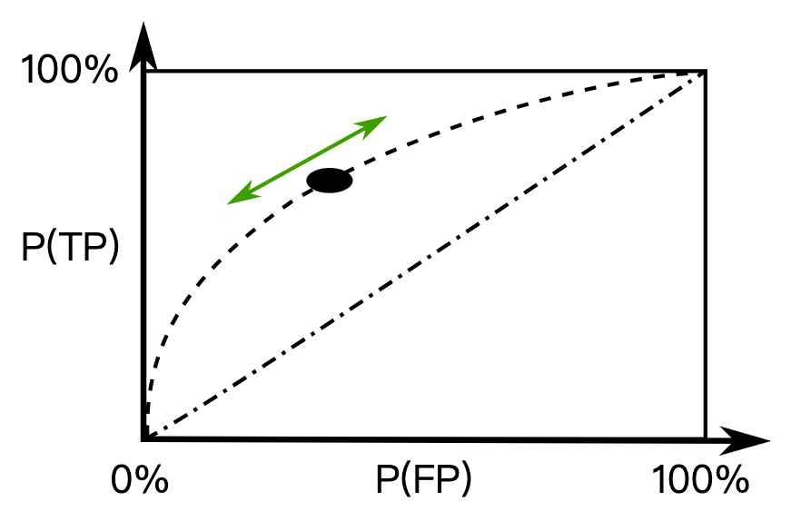

## 什么是 AUC

AUC (Area under the curve), 直译为曲线下面的面积。这里的曲线通常指的是 ROC (Receiver operating characteristic)。ROC 曲线是一种用于评估二分类模型的性能的图形工具。

对于二分类问题，预测模型通常会对样本预测一个得分 $s$ 或者概率 $p$，然后选取一个阈值将不同得分或者概率的样本分别划分为正样本和负样本进行预测。预测和实际结果的比对中可能会出现下面四种情况：

|          | 正样本     | 负样本     |
| -------- | ---------- | ---------- |
| 预测为正 | TP(真正例) | FP(假正例) |
| 预测为负 | FN(假负例) | TN(真负例) |

随着阈值 $t$ 的选取不同，这四类样本的比例也各不相同，定义真正例率 TPR 和假正例率 FPR 为：

$$
TPR = \frac{TP}{TP + FN}, \quad FPR = \frac{FP}{FP + TN}
$$

TPR 可以理解为做出正预测的可信度，FPR 可以理解为做出负预测的错误率。随着阈值从 $0$ 到 $1$ 变化，TPR 和 FPR 的坐标图会在平面直角坐标系中形成一条线，这就是 ROC 曲线。

如果预测器随机做出预测，那么平均情况下的 ROC 曲线是一条直线，因为随机情况下有 $TPR = FPR$。如果预测器能够完美做出预测，那么有 $TPR = 1, FPR = 0$，ROC 曲线应该是一条先上升再不变的折线。训练出来的模型的效果会介于随机情况下和理想情况下的 ROC 曲线之间，会呈现出一条曲线（折线）。



ROC 曲线下的面积即为 AUC

## AUC 有什么意义

AUC 尝尝被用来作为模型好坏的指标:

- $AUC = 0.5$ 表示模型没有分类能力，相当于随机猜测
- $0.5 < AUC < 0.7$ 表示模型有一定分类能力，但效果一般
- $0.7 \le AUC \le 0.9$ 表示模型有较好的分类能力
- $0.9 \le AUC$ 表示模型非常好的分类能力

AUC 是阈值无关的，该参数衡量了模型在所有可能的分类阈值下的表现，因此不受单一阈值的影响。并且 AUC 综合了 TPR 和 FPR 的信息，能够全面评估模型的性能。

但是 AUC 可能不适用于极度不平衡的数据，在极度不平衡的数据中 AUC 可能无法准确反应模型的性能。

### AUC 的概率解释

AUC 可以看作是随机从正负样本中选取一对正负样本，其中正样本大于负样本的概率。在*参考链接1*中有对这一性质进行证明。

### AUC 的排序特性

基于概率解释，AUC 实际上在说模型把一个正样本排在负样本之前的概率。所以这个概率常用在排序场景的模型评估，例如搜索和推荐等场景。

## 代码测试

```python
import numpy as np
import matplotlib.pyplot as plt
from sklearn.datasets import make_classification
from sklearn.model_selection import train_test_split
from sklearn.linear_model import LogisticRegression
from sklearn.metrics import roc_curve, roc_auc_score, accuracy_score, confusion_matrix

# 生成一个不平衡的武侠数据集
# 假设特征表示武功修炼时间、战斗胜率等，标签表示是否为高手
X, y = make_classification(n_samples=1000, n_features=20, n_classes=2, weights=[0.9, 0.1], random_state=42)

# 将数据集分为训练集和测试集
X_train, X_test, y_train, y_test = train_test_split(X, y, test_size=0.3, random_state=42)

# 训练一个逻辑回归模型
model = LogisticRegression()
model.fit(X_train, y_train)

# 预测测试集
y_pred_prob = model.predict_proba(X_test)[:, 1]

# 计算 ROC 曲线和 AUC
fpr, tpr, thresholds = roc_curve(y_test, y_pred_prob)
auc = roc_auc_score(y_test, y_pred_prob)

# 可视化结果
plt.figure(figsize=(10, 5))

plt.subplot(1, 2, 1)
plt.title("ROC 曲线")
plt.plot(fpr, tpr, color='blue', lw=2, label=f"AUC = {auc:.2f}")
plt.plot([0, 1], [0, 1], color='gray', lw=1, linestyle='--')
plt.xlabel("假阳性率")
plt.ylabel("真阳性率")
plt.legend(loc="lower right")

plt.subplot(1, 2, 2)
plt.title("AUC 值示意")
plt.fill_between(fpr, tpr, color='blue', alpha=0.3)
plt.plot(fpr, tpr, color='blue', lw=2, label=f"AUC = {auc:.2f}")
plt.xlabel("假阳性率")
plt.ylabel("真阳性率")
plt.legend(loc="lower right")

plt.tight_layout()
plt.show()

print(f"AUC: {auc:.2f}")

```

## 参考链接

- [深入理解 AUC](https://tracholar.github.io/machine-learning/2018/01/26/auc.html)
- [算法金 | 一文彻底理解机器学习 ROC-AUC](https://www.cnblogs.com/suanfajin/p/18241546)
