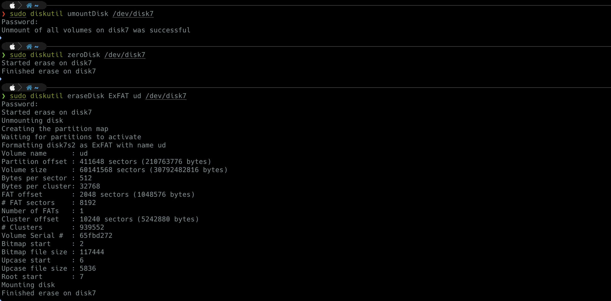

在 macos 中格式化可以通过磁盘工具(Disk Utility)来进行格式化，是一个系统自带的软件。也可以通过终端进行格式化，我在进行操作时通过磁盘工具进行抹除的方法失败了，所以只能通过终端进行格式化。

## 通过磁盘工具进行格式化

首先打开磁盘工具，`command + space`，搜索磁盘工具:


打开之后，在左侧选择列表中选择要进行格式化的磁盘（注意千万不要选错），然后点击顶部右侧的"抹掉"按钮。如图所示：


## 通过终端进行格式化（推荐）

如果图形化界面的抹除遇到了错误，那么最好通过终端命令行的方式来进行抹除。首先打开终端，输入`diskutil list`来列举出所有的磁盘，找到自己需要进行抹除的磁盘编号：


例如我这里找到我要抹除的磁盘就是`disk7`，使用下面的命令对进行格式化，注意实际使用使需要将其中的`disk7`替换为自己的磁盘：

```bash
# 首先对硬盘进行卸载
sudo diskutil umountDisk /dev/diskx

# 随后使用 0 来覆盖硬盘的所有扇区
sudo diskutil zeroDisk /dev/diskx

# 最后对硬盘重新进行分区，格式化U盘
sudo diskutil eraseDisk ExFAT ud /dev/diskx
```

如果想要格式化为其他格式，可以将`ExFAT`替换为其他格式，例如`APFS`等。

参考截图：


